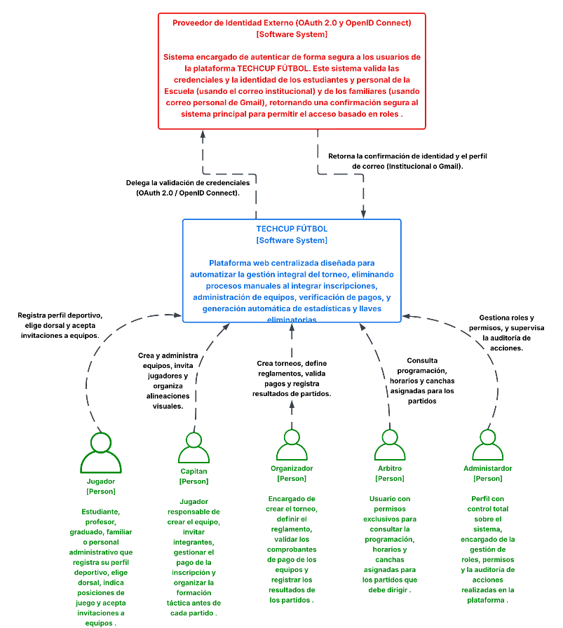
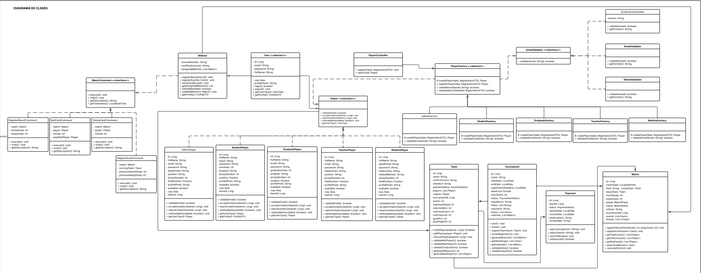
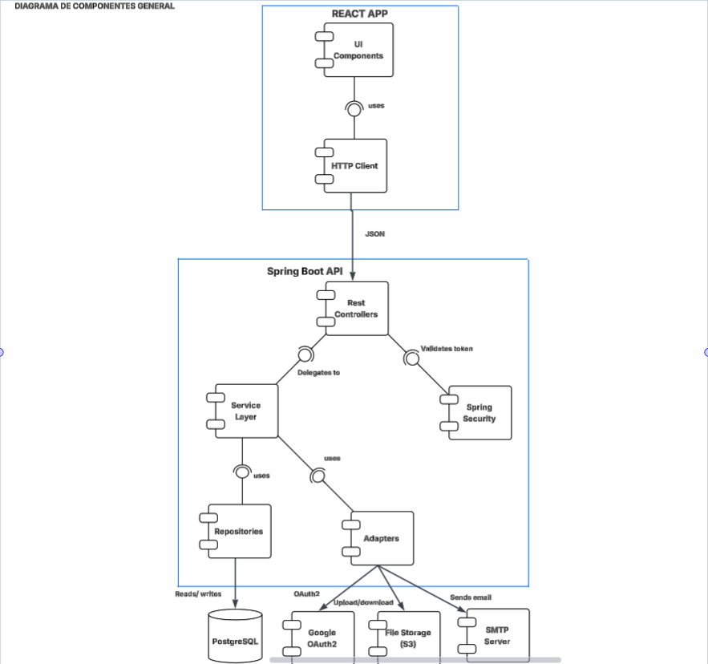
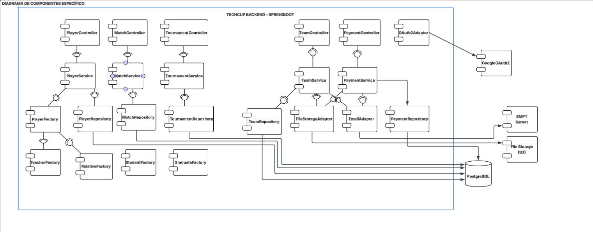
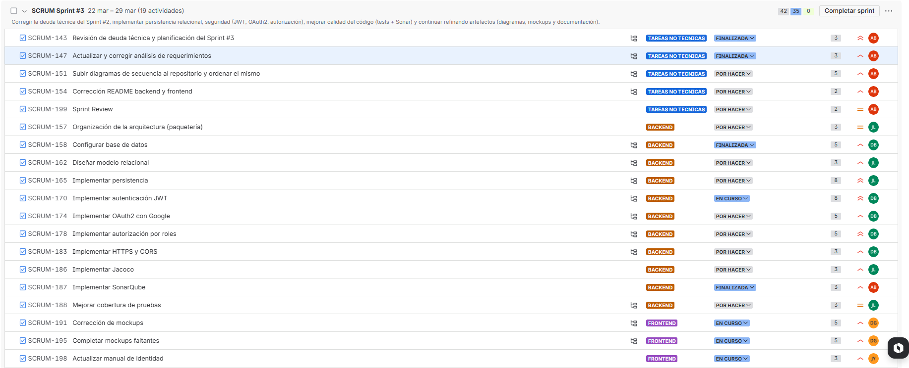

# **| JAVABURGUERS |**

### NOMBRES DE INTEGRANTES: 
- Andres Camilo Vivas Baquero
- Dana Valeria Leal Guzmán
- Daniel Julian Peña Bonilla
- Jose Luis Lancheros Ayora
- Juan Sebastian Murcia Yanquen

## TECHCUP FUTBOL
Plataforma web centralizada para la gestión integral del torneo semestral de fútbol de los programas de ingeniería 
de la Escuela Colombiana de Ingeniería Julio Garavito. Este sistema reemplaza los procesos manuales mediante la 
automatización de inscripciones, administración de equipos, verificación de pagos y cálculo de estadísticas en tiempo real.

---

## Instrucciones de Ejecución

### Prerrequisitos
* Java 21
* Maven 3.8+

### Pasos para ejecutar localmente
1. Clonar el repositorio:
   `git clone https://github.com/Lanch3ros/techcup-futbol.git `
2. Navegar a la carpeta del proyecto:
   `cd techcup-futbol`
3. Compilar el proyecto y descargar dependencias:
   `mvn clean install`
4. Ejecutar la aplicación Spring Boot:
   `mvn spring-boot:run`
5. La aplicación estará disponible en `http://localhost:8080`
6. Para visualizar la documentación de la API interactiva (Swagger), ingresa a:
   `http://localhost:8080/swagger-ui.html`

# ÍNDICE
### 0. LINKS PRESENTACIONES
**Sprint 1**

https://www.canva.com/design/DAHDIhwNdzU/ynjiJ__QOQWReNaZfXhO7Q/edit?utm_content=DAHDIhwNdzU&utm_campaign=designshare&utm_medium=link2&utm_source=sharebutton

**Sprint 2**

https://www.canva.com/design/DAHEoyICPoE/jg6A0KOsso8ERnJbRn0hRw/edit?utm_content=DAHEoyICPoE&utm_campaign=designshare&utm_medium=link2&utm_source=sharebutton

**Sprint 3**

https://www.canva.com/design/DAHFSF0epuE/R3Pq2PrtoQJfLQqHlH7F8Q/edit?utm_content=DAHFSF0epuE&utm_campaign=designshare&utm_medium=link2&utm_source=sharebutton

### 1. DIAGRAMAS

#### 1.1 DIAGRAMA DE CONTEXTO DEL SISTEMA

[DiagramaContexto.pdf](docs/uml/DiagramaContexto.pdf)

#### 1.2 DIAGRAMA DE CLASES

https://lucid.app/lucidchart/3777f7f9-49cb-4f47-859d-86e581460502/edit?viewport_loc=-1363%2C-885%2C3299%2C1490%2C0_0&invitationId=inv_96e5594f-9313-43cc-99e2-2ea8478b8063

#### 1.3 DIAGRAMAS DE SECUENCIA

#### 1.4 DIAGRAMAS DE COMPONENTES

### 2. ANÁLISIS DE REQUERIMIENTOS

[Plantilla Analisis de requerimientos.pdf](docs/requirements/Plantilla%20Analisis%20de%20requerimientos.pdf)

### 3. JIRA 

https://java-burguers-tech.atlassian.net/jira/software/projects/SCRUM/boards/1/backlog?atlOrigin=eyJpIjoiOWEwYzQwNzE3NzNjNDNlODk4ODFiZjliZDk2OTIzNzMiLCJwIjoiaiJ9