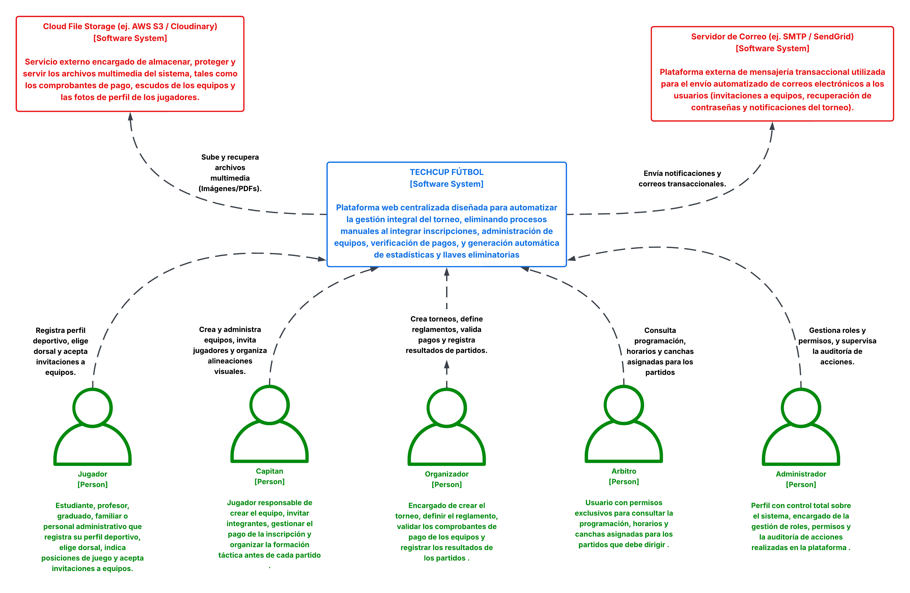
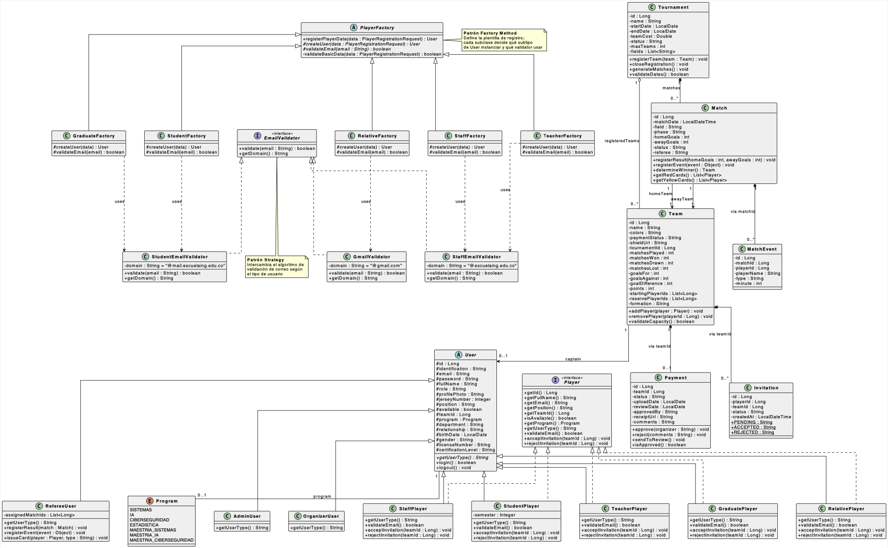
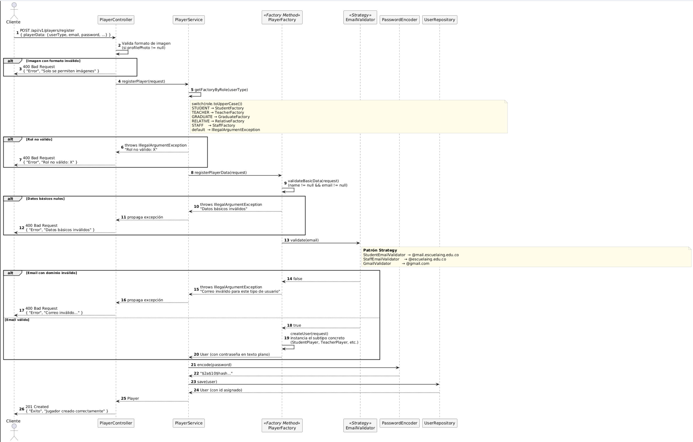
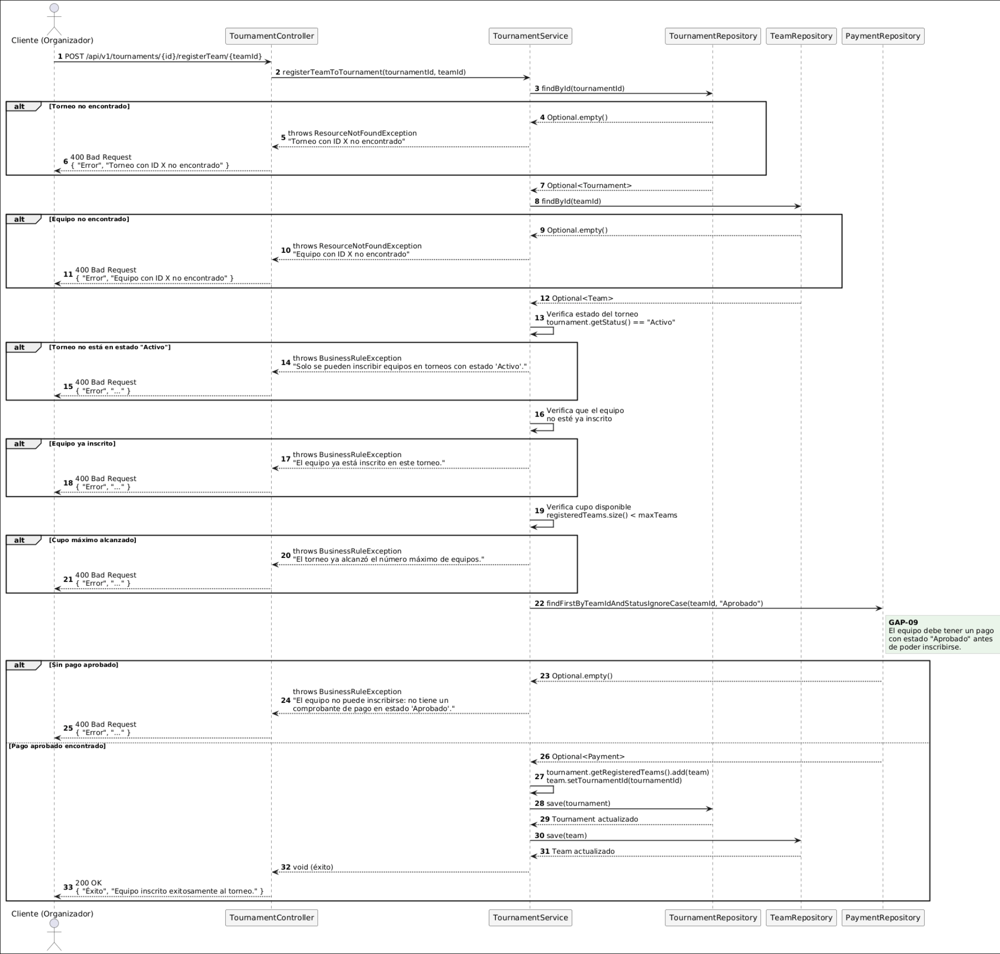
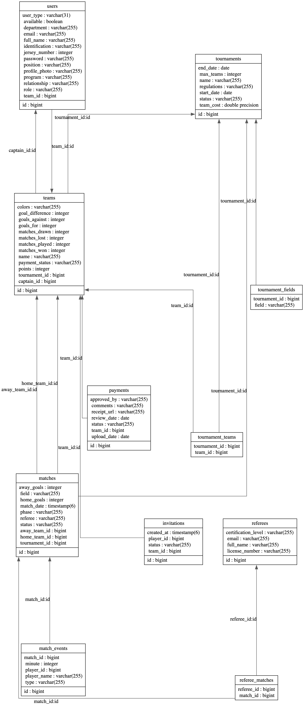
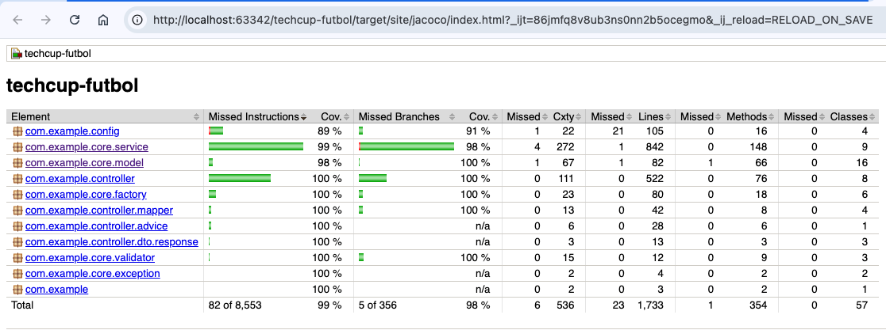
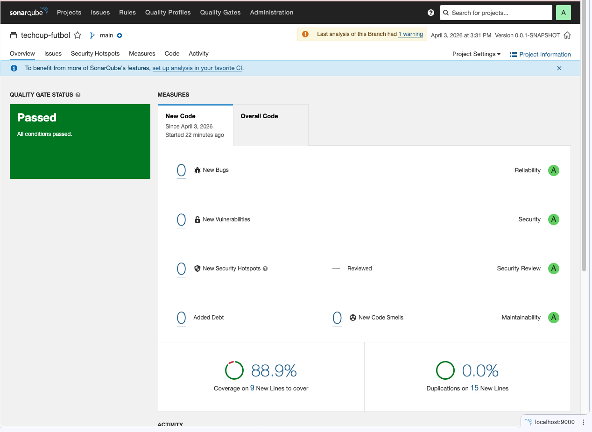

# **| JAVABURGUERS |**


### INTEGRANTES:
- Andres Camilo Vivas Baquero
- Dana Valeria Leal Guzmán
- Daniel Julian Peña Bonilla
- Jose Luis Lancheros Ayora
- Juan Sebastian Murcia Yanquen

## TECHCUP FÚTBOL
Plataforma backend para la gestión integral del torneo semestral de fútbol de los programas de ingeniería de la Escuela Colombiana de Ingeniería Julio Garavito. El sistema reemplaza los procesos manuales mediante la automatización de inscripciones, administración de equipos, verificación de pagos, seguimiento de partidos y cálculo de estadísticas en tiempo real.

---

## Instrucciones de Ejecución

### Prerrequisitos
* Java 21
* Maven 3.8+
* Docker (para levantar PostgreSQL 16)

### Opción A — Ejecución directa con Maven

1. Clonar el repositorio:
   `git clone https://github.com/Lanch3ros/techcup-futbol.git`
2. Navegar a la carpeta del proyecto:
   `cd techcup-futbol`
3. Levantar la base de datos PostgreSQL:
   `docker compose up -d postgres`
4. Ejecutar la suite de pruebas (verificación de integridad con 509 tests):
   `mvn clean test jacoco:report`
5. Ejecutar la aplicación Spring Boot:
   `mvn spring-boot:run -Dmaven.test.skip=true`
6. La aplicación estará disponible en `https://localhost:8443`
7. Para visualizar la documentación interactiva (Swagger / OpenAPI 3.1), ingresa a:
   `https://localhost:8443/swagger-ui.html`

### Opción B — Ejecución completa con Docker Compose

1. Clonar el repositorio:
   `git clone https://github.com/Lanch3ros/techcup-futbol.git`
2. Navegar a la carpeta del proyecto:
   `cd techcup-futbol`
3. Copiar el archivo de variables de entorno y completar los valores:
   `cp .env.example .env`
4. Levantar PostgreSQL y la aplicación:
   `docker compose up --build`
5. La aplicación estará disponible en `https://localhost:8443`
6. Para visualizar la documentación interactiva (Swagger / OpenAPI 3.1), ingresa a:
   `https://localhost:8443/swagger-ui.html`

> **Nota:** La aplicación requiere un keystore PKCS12 en `src/main/resources/keystore.p12` para habilitar HTTPS. La contraseña del keystore se configura mediante la variable de entorno `SSL_KEY_STORE_PASSWORD` (valor por defecto: `techcup123`).

---

# ÍNDICE
### 0. PRESENTACIONES SPRINT
* **Sprint 1:** [Enlace a Canva](https://www.canva.com/design/DAHDIhwNdzU/ynjiJ__QOQWReNaZfXhO7Q/edit?utm_content=DAHDIhwNdzU&utm_campaign=designshare&utm_medium=link2&utm_source=sharebutton)
* **Sprint 2:** [Enlace a Canva](https://www.canva.com/design/DAHEoyICPoE/jg6A0KOsso8ERnJbRn0hRw/edit?utm_content=DAHEoyICPoE&utm_campaign=designshare&utm_medium=link2&utm_source=sharebutton)
* **Sprint 3:** [Enlace a Canva](https://www.canva.com/design/DAHFSF0epuE/R3Pq2PrtoQJfLQqHlH7F8Q/edit?utm_content=DAHFSF0epuE&utm_campaign=designshare&utm_medium=link2&utm_source=sharebutton)
* **Sprint 4:** _Próximamente_

---

## Despliegues

| Ambiente | URL API | Swagger |
|----------|---------|---------|
| **QA** | `https://techcup-backend-qa-1-gva9hqfdeqard9bf.centralus-01.azurewebsites.net` | [Swagger QA](https://techcup-backend-qa-1-gva9hqfdeqard9bf.centralus-01.azurewebsites.net/swagger-ui/index.html) |
| **PROD** | `https://techcup-backend-prod-1-awagabefhwadb2g9.centralus-01.azurewebsites.net` | [Swagger PROD](https://techcup-backend-prod-1-awagabefhwadb2g9.centralus-01.azurewebsites.net/swagger-ui/index.html) |

El despliegue es automático vía GitHub Actions:
- Cada push a `develop` → deploy automático a **QA** (tras pasar el CI)
- Cada merge a `main` → deploy automático a **PROD** (tras pasar el CI)

---

### 1. ARQUITECTURA Y PATRONES DE DISEÑO

El backend sigue una **arquitectura en capas** (Controller → Service → Repository → Model) con preocupaciones transversales en el paquete `core/`. Los patrones de diseño implementados garantizan extensibilidad y cumplen estrictamente las reglas de negocio del torneo.

**Arquitectura en Capas (MVC adaptado a REST API)**
- **¿Por qué lo elegimos?** Es el estándar de la industria para aplicaciones web con Spring Boot, permitiendo separar responsabilidades (Separation of Concerns).
- **¿Cómo ayuda a resolver el problema?** Aísla la capa de presentación (REST Controllers) de la lógica de negocio (Services) y del acceso a datos (Repositories). Esto permite, por ejemplo, validar tokens JWT en los filtros de seguridad sin acoplar ese proceso al cálculo de estadísticas o la generación de brackets del torneo.

**Factory Method — `PlayerFactory`**
- **¿Por qué lo elegimos?** El sistema gestiona múltiples tipos de jugadores (`StudentPlayer`, `GraduatePlayer`, `TeacherPlayer`, `RelativePlayer`, `StaffPlayer`). Todos comparten atributos base (nombre, correo, contraseña), pero cada tipo tiene reglas de creación y validación de correo distintas.
- **¿Cómo ayuda a resolver el problema?** Centraliza la lógica de instanciación en una jerarquía de fábricas. El endpoint público de registro delega a la fábrica correspondiente según el `userType` recibido. Esto separa estructuralmente la "Identidad" (clase abstracta `User`, usada para autenticación JWT) del "Comportamiento como jugador" (interfaz `Player`), evitando que usuarios de gestión (`AdminUser`, `OrganizerUser`, `RefereeUser`) hereden propiedades irrelevantes como el número dorsal.

**Strategy — `EmailValidator`**
- **¿Por qué lo elegimos?** Existen reglas estrictas de dominio de correo por tipo de usuario: estudiantes y egresados usan `@mail.escuelaing.edu.co`, profesores y staff usan `@escuelaing.edu.co`, y familiares usan Gmail.
- **¿Cómo ayuda a resolver el problema?** Cada regla de validación está encapsulada en su propia clase (`StudentEmailValidator`, `StaffEmailValidator`, `GmailValidator`). La fábrica selecciona dinámicamente la estrategia correcta antes de persistir el usuario. Si la universidad cambia su dominio, solo se modifica una clase concreta sin alterar la lógica global.

---

### 2. DIAGRAMAS

#### 2.1 DIAGRAMA DE CONTEXTO DEL SISTEMA
Representa cómo interactúa TechCup Fútbol con los actores externos. Su propósito es mostrar los límites del sistema y las integraciones externas.



* **Jugadores / Capitanes:** Registran perfiles, aceptan invitaciones, suben comprobantes de pago y configuran alineaciones.
* **Personal de Gestión (Organizador, Administrador):** Administran el ciclo de vida completo del torneo y gestionan la seguridad del sistema.
* **Árbitros:** Registran resultados, eventos de partido (goles, tarjetas) y actualizan estados de partido.
* **Sistemas externos:** Almacenamiento de archivos para fotos de perfil y comprobantes de pago; Google OAuth2 para autenticación de usuarios externos.

#### 2.2 DIAGRAMA DE CLASES (Core de Negocio)
Enfocado en las entidades de dominio y la aplicación de los patrones de diseño. Destaca:
- La jerarquía de herencia con estrategia **`SINGLE_TABLE`** (`@DiscriminatorColumn = user_type`): una clase base abstracta `User` de la cual extienden todos los usuarios del sistema.
- Los actores que participan en partidos implementan adicionalmente la interfaz `Player` (`StudentPlayer`, `TeacherPlayer`, `GraduatePlayer`, `RelativePlayer`, `StaffPlayer`).
- Los usuarios de gestión (`AdminUser`, `OrganizerUser`, `RefereeUser`) solo extienden `User`, sin heredar propiedades de jugador.
- El patrón **Factory Method** (`PlayerFactory` y sus implementaciones) y el patrón **Strategy** (`EmailValidator` y sus implementaciones) quedan explícitamente representados.



#### 2.3 DIAGRAMAS DE SECUENCIA

Los siguientes diagramas documentan los flujos transaccionales críticos del sistema, implementados en el Sprint 2.

* **Flujo 1: Registro de Jugador** — Ilustra la cadena `PlayerController → PlayerService → PlayerFactory (Factory Method) → EmailValidator (Strategy) → PasswordEncoder → UserRepository`, incluyendo las rutas alternativas para rol inválido, email con dominio incorrecto y foto de perfil con formato no permitido.



Para más detalle: [Registro de Jugador (PDF)](docs/uml/SequenceDiagramFlujo1RegistroJugador.pdf)

* **Flujo 2: Inscripción de Equipo a Torneo** — Ilustra las validaciones en cascada de `TournamentService`: estado del torneo (`Activo`), cupo disponible, inscripción previa y la verificación de pago aprobado (GAP-09 vía `PaymentRepository`).



Para más detalle: [Inscripción de Equipo a Torneo (PDF)](docs/uml/SequenceDiagramFlujo2InscripcionEquipoTorneo.pdf)

#### 2.4 DIAGRAMAS DE COMPONENTES

**Diagrama de Componentes General (Vista Macro)**
Muestra los bloques tecnológicos principales: una SPA en React que se comunica vía JSON/HTTPS con la API Spring Boot, la cual persiste en PostgreSQL 16. La comunicación es cifrada mediante SSL/TLS (puerto 8443).


**Diagrama de Componentes Específico (Arquitectura Interna)**
Detalla las capas del backend:
1. `config/`: Seguridad (filtro JWT, CORS, SSL), seeder de base de datos y configuración de Swagger.
2. `controller/`: Exposición de endpoints REST, manejo de DTOs y mappers entidad↔DTO.
3. `core/service/`: Lógica de negocio (`MatchService`, `TournamentService`, `StatsService`, `GoogleTokenVerifierService`).
4. `repository/`: Interfaces de Spring Data JPA (`UserRepository`, `TournamentRepository`, `PaymentRepository`, etc.).


#### 2.5 DIAGRAMA ER (ENTIDAD-RELACIÓN)
Representa el modelo físico implementado en **PostgreSQL 16** con `ddl-auto: update` (Hibernate gestiona el esquema automáticamente):

- **`users`**: Tabla única para todos los tipos de usuario mediante la estrategia **`SINGLE_TABLE`** de JPA. La columna discriminadora `user_type` determina el subtipo (`STUDENT`, `TEACHER`, `GRADUATE`, `RELATIVE`, `STAFF`, `ADMIN`, `ORGANIZER`, `REFEREE`). Los campos no aplicables al subtipo se almacenan como `NULL`.
- **`teams` / `tournaments`**: Relación Muchos-a-Muchos mediante la tabla intermedia `tournament_teams`.
- **`tournament_teams`**: Tabla de unión generada por `@ManyToMany @JoinTable`.
- **`team_starting_players` / `team_reserve_players`**: Tablas de colección generadas por `@ElementCollection` para persistir las listas de IDs de la alineación.
- **`referee_matches`**: Tabla de colección para los IDs de partidos asignados a cada árbitro.
- **`invitations`**: Persiste el ciclo de vida de cada invitación equipo→jugador (`PENDING → ACCEPTED / REJECTED`).



---

### 3. SEGURIDAD Y CONTROL DE ACCESO (RBAC)

El sistema implementa una estrategia de seguridad **multicapa y Stateless** que combina autenticación nativa con integración externa.

#### 3.1 Autenticación Mixta

| Mecanismo         | Endpoint                   | Descripción                                                                                                                                                                                                                |
|-------------------|----------------------------|----------------------------------------------------------------------------------------------------------------------------------------------------------------------------------------------------------------------------|
| **JWT nativo**    | `POST /api/v1/auth/login`  | Valida credenciales contra la BD (BCrypt). Emite un JWT HS256 con TTL de **1 hora**.                                                                                                                                       |
| **Google OAuth2** | `POST /api/v1/auth/google` | Recibe el ID Token de Google Sign-In, lo verifica contra `oauth2.googleapis.com/tokeninfo`, y crea el usuario en BD (como `RelativePlayer` con rol `JUGADOR`) si es su primer acceso. Devuelve un JWT interno equivalente. |

Ambos flujos retornan el mismo formato de respuesta `{ token, email }` para transparencia total hacia el cliente.

#### 3.2 Pipeline de Autenticación JWT

Cada request protegido pasa por el siguiente pipeline antes de llegar al controller:

```
Request → JwtAuthenticationFilter
              ↓
         JwtService.isTokenValid()
              ↓
         CustomUserDetailsService.loadUserByUsername(email)
              ↓ (resolución de roles)
         SecurityContextHolder ← UsernamePasswordAuthenticationToken
              ↓
         Controller
```

La resolución de roles en `CustomUserDetailsService` usa `user.getRole()` si está explícitamente asignado; de lo contrario, lo infiere del tipo concreto (`AdminUser → ROLE_ADMIN`, `OrganizerUser → ROLE_ORGANIZADOR`, `RefereeUser → ROLE_ARBITRO`, cualquier `Player → ROLE_JUGADOR`).

#### 3.3 Autorización por Roles (RBAC)

| Rol                | Permisos clave                                                                                                 |
|--------------------|----------------------------------------------------------------------------------------------------------------|
| `ROLE_ADMIN`       | Acceso total a todos los endpoints                                                                             |
| `ROLE_ORGANIZADOR` | Crear torneos, gestionar estados, inscribir equipos, asignar árbitros, aprobar/rechazar pagos, crear partidos  |
| `ROLE_ARBITRO`     | Actualizar estado de partido, registrar resultado y eventos (goles, tarjetas)                                  |
| `ROLE_CAPITAN`     | Crear equipo, inscribir equipo a torneo, configurar alineación, enviar invitaciones, subir comprobante de pago |
| `ROLE_JUGADOR`     | Acceso de lectura a recursos autenticados; responder invitaciones                                              |
| _(sin token)_      | Registro público (`/players/register`), login, consulta de torneos/partidos/estadísticas (GET)                 |

#### 3.4 Integridad Web

| Control         | Configuración                                                                                                                           |
|-----------------|-----------------------------------------------------------------------------------------------------------------------------------------|
| **HTTPS / SSL** | Puerto `8443`, keystore PKCS12 (`classpath:keystore.p12`), configurable vía `SSL_KEY_STORE_PASSWORD`                                    |
| **CORS**        | Origen permitido: `http://localhost:3000`; métodos: GET, POST, PUT, DELETE, OPTIONS                                                     |
| **CSRF**        | Deshabilitado intencionalmente (`// NOSONAR`): API completamente Stateless con JWT; no se utilizan sesiones ni cookies de autenticación |
| **HTTP Basic**  | Deshabilitado: el único mecanismo de autenticación es el Bearer JWT                                                                     |
| **Sesiones**    | `STATELESS`: Spring Security no crea ni gestiona sesiones HTTP                                                                          |

#### 3.5 Seeder de Usuarios del Sistema

`DatabaseSeeder` inserta tres perfiles maestros al primer arranque (idempotente — verifica `admin@techcup.edu.co` antes de insertar). La contraseña por defecto se inyecta vía `@Value("${app.seed.admin-password}")` y puede ser sobreescrita con la variable de entorno `APP_SEED_ADMIN_PASSWORD`:

| Email                        | Rol           | Discriminador |
|------------------------------|---------------|---------------|
| `admin@techcup.edu.co`       | `ADMIN`       | `ADMIN`       |
| `organizador@techcup.edu.co` | `ORGANIZADOR` | `ORGANIZER`   |
| `arbitro@techcup.edu.co`     | `ARBITRO`     | `REFEREE`     |

---

### 4. CALIDAD Y DEUDA TÉCNICA (TESTING)

Para garantizar el control de la deuda técnica, el proyecto cuenta con un entorno de validación robusto y escaneos de calidad automatizados que acompañan cada Sprint.

#### 4.1 Pruebas Unitarias y Cobertura

* **509 tests** ejecutados con JUnit 5 y Mockito — todos en verde.
* **Estrategia por capa:**
  * *Service*: Mockito puro, inyección manual por constructor, sin contexto Spring.
  * *Controller*: Instanciación directa `new Controller(mockService)`, aserciones sobre `ResponseEntity`.
  * *Config*: `@SpringBootTest(webEnvironment = NONE)` para beans reales sin servidor HTTP.
  * *Model*: Instanciación directa + reflexión Java para métodos `@PrePersist` privados.
* **Cobertura (JaCoCo):** **100%** en instrucciones, líneas, métodos y clases — **99.2% en ramas**. Las 3 ramas no cubiertas son falsos negativos estructurales aceptados (paths imposibles en `TeamService#isValidProgram`, `TeamService#isMasterProgram` y `JwtService#isTokenValid`).



#### 4.2 Análisis Estático (SonarQube)

El proyecto supera el *Quality Gate* del Sprint 3 con calificación **A** en todas las dimensiones del código nuevo (*New Code*):

| Dimensión                 | Calificación  | Detalle                |
|---------------------------|---------------|------------------------|
| **Fiabilidad**            | **A**         | 0 Bugs                 |
| **Seguridad**             | **A**         | 0 Vulnerabilidades     |
| **Mantenibilidad**        | **A**         | 0 Code Smells          |
| **Hotspots de Seguridad** | **Revisados** | 0% de riesgo pendiente |

Las deudas técnicas del Sprint 3 resueltas incluyen:
- **S2201** (`OAuth2Controller`): resultado de `orElseGet()` asignado a variable y utilizado.
- **S6437** (`DatabaseSeeder`): contraseña hardcodeada eliminada; se inyecta vía `@Value`.
- **S4502** (`SecurityConfig`): CSRF deshabilitado con `// NOSONAR` — justificado por la naturaleza Stateless (JWT) de la arquitectura; sin sesiones ni cookies de sesión, el vector de ataque CSRF no existe.



---

### 5. ANÁLISIS DE REQUERIMIENTOS Y GESTIÓN

Ir a la ruta `docs/requirements/RequirementsAnalisis.pdf` o darle click a
[Requirements Analisis](docs/requirements/RequirementsAnalisis.pdf)

* **Gestión en Jira:** Todo el Product Backlog, Épicas e Historias de Usuario están trazadas en el board ágil del equipo.

  
