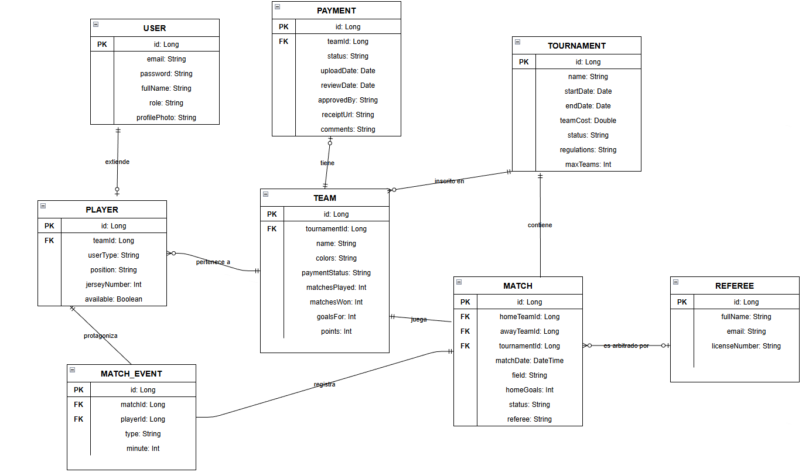
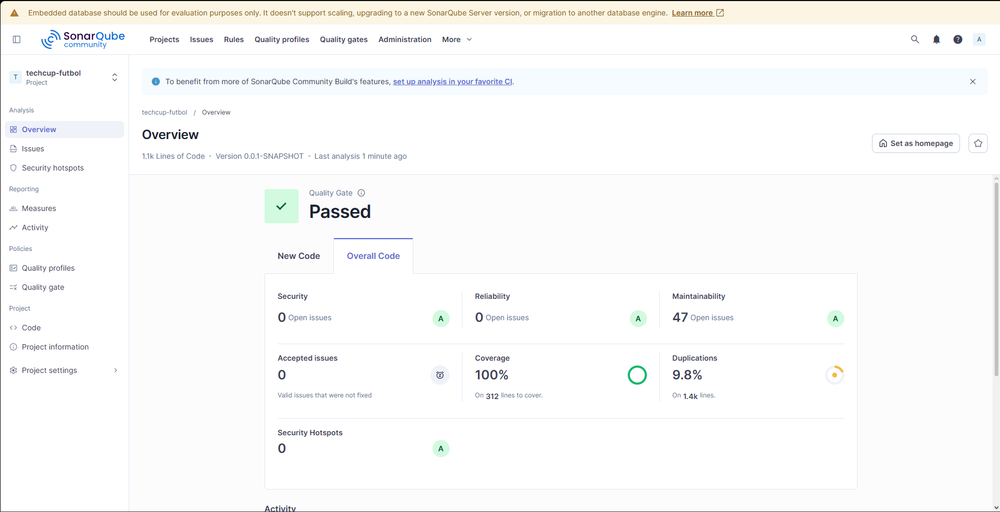

# **| JAVABURGUERS |**

### NOMBRES DE INTEGRANTES: 
- Andres Camilo Vivas Baquero
- Dana Valeria Leal Guzmán
- Daniel Julian Peña Bonilla
- Jose Luis Lancheros Ayora
- Juan Sebastian Murcia Yanquen

## TECHCUP FUTBOL
Plataforma web centralizada para la gestión integral del torneo semestral de fútbol de los programas de ingeniería 
de la Escuela Colombiana de Ingeniería Julio Garavito. Este sistema reemplaza los procesos manuales mediante la 
automatización de inscripciones, administración de equipos, verificación de pagos y cálculo de estadísticas en tiempo real.

---

## Instrucciones de Ejecución

### Prerrequisitos
* Java 21
* Maven 3.8+

### Pasos para ejecutar localmente
1. Clonar el repositorio:
   `git clone https://github.com/Lanch3ros/techcup-futbol.git `
2. Navegar a la carpeta del proyecto:
   `cd techcup-futbol`
3. Compilar el proyecto y descargar dependencias:
   `mvn clean install`
4. Ejecutar la aplicación Spring Boot:
   `mvn spring-boot:run`
5. La aplicación estará disponible en `http://localhost:8080`
6. Para visualizar la documentación de la API interactiva (Swagger), ingresa a:
   `http://localhost:8080/swagger-ui.html`

# ÍNDICE
### 0. LINKS PRESENTACIONES
**Sprint 1**

https://www.canva.com/design/DAHDIhwNdzU/ynjiJ__QOQWReNaZfXhO7Q/edit?utm_content=DAHDIhwNdzU&utm_campaign=designshare&utm_medium=link2&utm_source=sharebutton

**Sprint 2**

https://www.canva.com/design/DAHEoyICPoE/jg6A0KOsso8ERnJbRn0hRw/edit?utm_content=DAHEoyICPoE&utm_campaign=designshare&utm_medium=link2&utm_source=sharebutton

**Sprint 3**

https://www.canva.com/design/DAHFSF0epuE/R3Pq2PrtoQJfLQqHlH7F8Q/edit?utm_content=DAHFSF0epuE&utm_campaign=designshare&utm_medium=link2&utm_source=sharebutton

### 1. DIAGRAMAS

#### 1.1 DIAGRAMA DE CONTEXTO DEL SISTEMA

El diagrama de contexto representa a alto nivel cómo interactúa el sistema TECHCUP FÚTBOL con los actores externos que lo rodean. Su propósito es mostrar los límites del sistema y las relaciones que tiene con el mundo exterior, sin entrar en detalles técnicos internos.

Actores del sistema:

- Jugador: Estudiante, profesor, graduado, familiar o personal administrativo que se registra en la plataforma. Registra su perfil deportivo, elige su número dorsal, indica su posición de juego y acepta o rechaza invitaciones a equipos.
- Capitán: Jugador responsable de crear el equipo, invitar integrantes, gestionar el pago de la inscripción y organizar la formación táctica antes de cada partido.
- Organizador: Encargado de crear el torneo, definir el reglamento, validar los comprobantes de pago de los equipos y registrar los resultados de los partidos.
- Árbitro: Usuario con permisos exclusivos para consultar la programación, horarios y canchas asignadas para los partidos que debe dirigir.
- Administrador: Perfil con control total sobre el sistema, encargado de la gestión de roles, permisos y la auditoría de acciones realizadas en la plataforma.

Sistema externo:

Proveedor de Identidad Externo (OAuth 2.0 / OpenID Connect): Sistema encargado de autenticar de forma segura a los usuarios. Valida las credenciales del personal de la Escuela mediante correo institucional y de los familiares mediante correo Gmail, retornando una confirmación de identidad al sistema principal para permitir el acceso basado en roles.

[DiagramaContexto.pdf](docs/uml/DiagramaContexto.pdf)

#### 1.2 DIAGRAMA DE CLASES

**Patrónes utilizados**

**Factory Method - PlayerFactory**
- ¿Por qué lo elegimos?
    - El sistema tiene cinco tipos de participantes Estudiante, Graduado, Profesor, Personal Administrativo y Familiar que
      comparten atributos comunes como nombre, correo y posición de juego, pero tienen diferencias concretas en cómo se crean
      y validan. El Estudiante y el Graduado se registran con correo institucional, el Familiar con Gmail, el Profesor tiene
      departamento y cargo.

- ¿Cómo ayuda a resolver el problema del sistema?
    - Factory Method centraliza la creación de cada tipo de Jugador en su propia fábrica. Cuando llega una solicitud de
      registro al PlayerController, este simplemente delega a la PlayerFactory correspondiente según el userType recibido,
      y esa fábrica construye el objeto correcto con sus validaciones propias.

**Strategy - EmailValidator**
- ¿Por qué lo eligieron?
    - Porque no todos los jugadores usan el mismo tipo de correo. Un estudiante debe registrarse con correo institucional,
      un familiar con Gmail, un administrativo con su correo de la universidad. Si no usáramos este patrón, tendríamos que
      escribir la misma lógica de validación repetida en cada tipo de jugador, y si algo cambia habría que buscarla y
      modificarla en varios lugares al mismo tiempo.
- ¿Cómo ayuda a resolver el problema del sistema?
    - Cada regla de validación vive en su propia clase. Cuando se registra un jugador, el sistema simplemente escoge el
      validador que le corresponde según su tipo y lo aplica. Si mañana la universidad cambia su dominio de correo,
      solo se toca una clase. Si se agrega un nuevo tipo de jugador, solo se crea un validador nuevo sin tocar nada más.

**Command - MatchCommand**
- ¿Por qué lo eligieron?
    - Porque el árbitro puede equivocarse. Si registra un gol que no era o una tarjeta al jugador incorrecto, necesita poder corregirlo.
      Sin este patrón no habría forma ordenada de deshacer una acción ya ejecutada, y tampoco habría registro de todo lo que pasó
      durante el partido.
- ¿Cómo ayuda a resolver el problema del sistema?
    - Cada acción del árbitro se guarda como un objeto independiente antes de ejecutarse. Ese objeto recuerda cómo estaba el
      partido antes del cambio, así que si algo estuvo mal simplemente se deshace y el partido vuelve al estado anterior.
      Además, como todas las acciones quedan guardadas en orden, al final del partido existe un historial completo de todo
      lo que el árbitro registró y corrigió.

https://lucid.app/lucidchart/3777f7f9-49cb-4f47-859d-86e581460502/edit?viewport_loc=-1363%2C-885%2C3299%2C1490%2C0_0&invitationId=inv_96e5594f-9313-43cc-99e2-2ea8478b8063

#### 1.3 DIAGRAMAS DE SECUENCIA

#### 1.4 DIAGRAMAS DE COMPONENTES

**Diagrama de Componentes General**
El diagrama de componentes general muestra la arquitectura del sistema desde una perspectiva de alto nivel, describiendo los bloques tecnológicos principales y cómo se comunican entre sí.

Componentes principales:

- React App (Frontend): Aplicación web construida en React que contiene los componentes de interfaz de usuario (UI Components) y un cliente HTTP (HTTP Client) encargado de realizar las peticiones al backend en formato JSON.
- Spring Boot API (Backend): Núcleo del sistema, organizado internamente en capas: los Rest Controllers reciben las peticiones HTTP, delegan la lógica al Service Layer y validan los tokens de autenticación a través de Spring Security. El Service Layer utiliza los Repositories para persistir datos y los Adapters para comunicarse con servicios externos.
- Servicios externos:
PostgreSQL: Base de datos relacional donde se almacenan todos los datos del torneo.
Google OAuth2: Servicio de autenticación delegada para validar identidades institucionales y de Gmail.
File Storage (S3): Almacenamiento de archivos para fotos de perfil y comprobantes de pago.
SMTP Server: Servidor de correo para el envío de notificaciones a los usuarios.

**Diagrama de Componentes Específico**
El diagrama de componentes específico detalla la arquitectura interna del backend de TECHCUP FÚTBOL construido en Spring Boot, mostrando cada componente individual y sus dependencias exactas.
- Capa de controladores (Controllers): Los controladores PlayerController, MatchController, TournamentController, TeamController y PaymentController exponen los endpoints REST de la API. Cada uno recibe las peticiones HTTP y las delega a su servicio correspondiente. El OAuth2Adapter se encarga de la comunicación con GoogleOAuth2 para la autenticación.
- Capa de servicios (Services): PlayerService, MatchService, TournamentService, TeamService y PaymentService contienen la lógica de negocio del sistema. Aplican las validaciones, las reglas del torneo y coordinan las operaciones entre repositorios y adaptadores.
- Capa de fábricas (Factories): El PlayerFactory implementa el patrón Factory Method para crear los distintos tipos de jugadores según su rol: StudentFactory, TeacherFactory, GraduateFactory y RelativeFactory. Cada fábrica se encarga de validar el correo electrónico correspondiente a su tipo de usuario.
- Capa de repositorios (Repositories): PlayerRepository, MatchRepository, TournamentRepository, TeamRepository y PaymentRepository gestionan la persistencia de los datos, comunicándose directamente con la base de datos PostgreSQL.
- Adaptadores (Adapters): FileStorageAdapter gestiona la subida y descarga de archivos hacia File Storage (S3). EmailAdapter se comunica con el SMTP Server para el envío de correos. Ambos son utilizados por los servicios cuando la lógica de negocio lo requiere.

#### 1.5 DIAGRAMA ER (ENTIDAD-RELACIÓN)

El diagrama de entidad relación representa la estructura lógica de la base de datos del sistema, mostrando cómo se organizan y relacionan los datos entre sí. Cada entidad corresponde a una tabla en PostgreSQL, cada atributo a una columna, y las líneas entre entidades representan las relaciones con su cardinalidad.
Entidades y relaciones principales:

- USER y PLAYER: USER es la clase base que contiene los datos de autenticación (email, contraseña, foto de perfil). PLAYER extiende a USER en una relación 1 a 1, añadiendo atributos deportivos como posición, dorsal y disponibilidad. El campo userType identifica el subtipo del jugador: estudiante, profesor, graduado, familiar o administrativo.
- PLAYER y TEAM: Un jugador puede pertenecer a cero o un equipo, y un equipo puede tener entre 0 y 12 jugadores, implementando una relación muchos a uno. Al aceptar una invitación, el campo teamId en PLAYER se actualiza y su disponibilidad cambia a false.
- TEAM y TOURNAMENT: Un equipo se inscribe en un torneo en una relación muchos a uno. El torneo controla su ciclo de vida mediante el campo status (Borrador -> Activo -> En progreso -> Finalizado) y define el número máximo de equipos permitidos con maxTeams.
- TOURNAMENT y MATCH: Un torneo contiene múltiples partidos en una relación uno a muchos. Cada MATCH referencia dos equipos mediante homeTeamId y awayTeamId, ambas llaves foráneas hacia TEAM, representando el equipo local y el visitante respectivamente.
- MATCH y MATCH_EVENT: Durante un partido se registran eventos como goles, tarjetas amarillas y rojas en una relación uno a muchos. Cada evento referencia el partido (matchId) y el jugador involucrado (playerId), y almacena el tipo de evento y el minuto en que ocurrió.
- TEAM y PAYMENT: Cada equipo tiene asociado un comprobante de pago en una relación uno a uno. El pago gestiona su propio ciclo de estados: Pendiente -> En revisión -> Aprobado / Rechazado, e incluye la URL del comprobante y los comentarios del organizador.
- MATCH y REFEREE: Un árbitro puede estar asignado a múltiples partidos en una relación uno a muchos, lo que permite consultar su programación completa de partidos mediante el campo licenseNumber como identificador oficial.

### 2. ANÁLISIS DE REQUERIMIENTOS

[Plantilla Analisis de requerimientos.pdf](docs/requirements/Plantilla%20Analisis%20de%20requerimientos.pdf)

### 3. JIRA 

El Product Backlog es uno de los artefactos fundamentales del framework Scrum. Representa la lista completa, 
ordenada y priorizada de todo el trabajo que debe realizarse para construir el producto. En el contexto de TECHCUP FÚTBOL, 
el backlog fue gestionado a través de Jira, herramienta que permitió al equipo planificar, asignar, estimar y hacer seguimiento 
de cada tarea a lo largo del desarrollo del proyecto.

https://java-burguers-tech.atlassian.net/jira/software/projects/SCRUM/boards/1/backlog?atlOrigin=eyJpIjoiOWEwYzQwNzE3NzNjNDNlODk4ODFiZjliZDk2OTIzNzMiLCJwIjoiaiJ9

### 4. ANALISIS ESTÁTICO CON SONARQUBE

