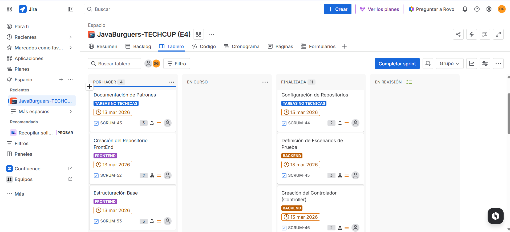
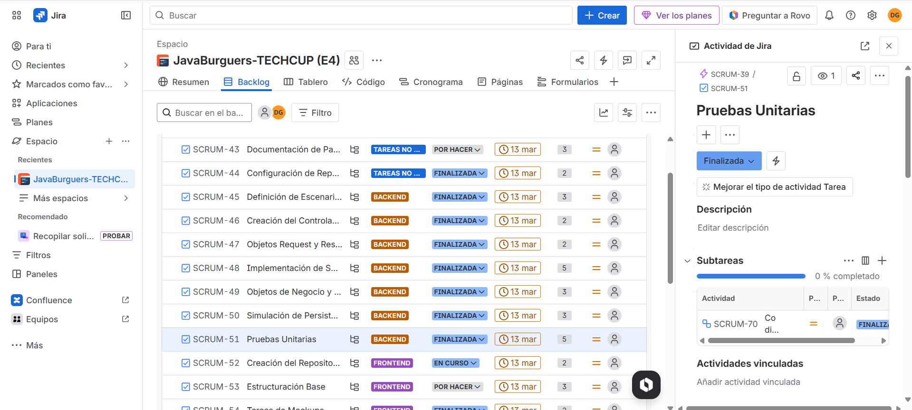
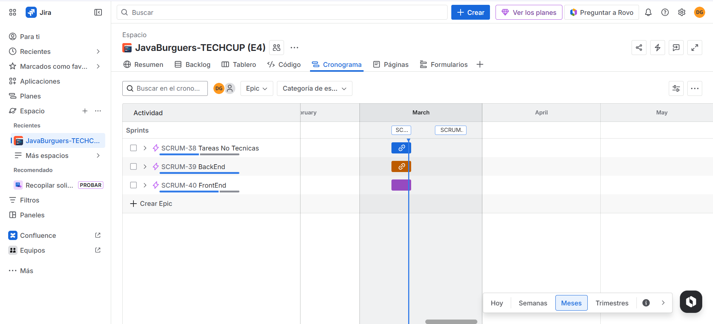
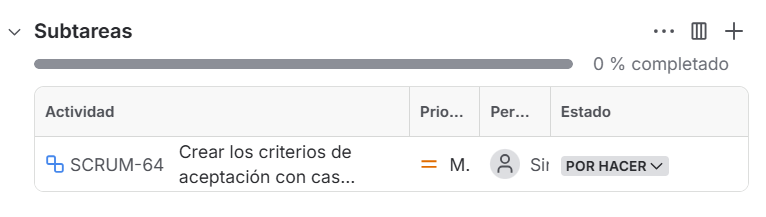

# **| JAVABURGUERS |**
### NOMBRES DE INTEGRANTES: 
- Andres Camilo Vivas
- Dana Valeria Leal Guzmán
- Daniel Peña
- Jose Luis Lancheros Ayora
- Juan Sebastian Murcia
- Mateo Moreno

## TECHCUP FUTBOL
Plataforma web centralizada para la gestión integral del torneo semestral de fútbol de los programas de ingeniería de la Escuela Colombiana de Ingeniería Julio Garavito. Este sistema reemplaza los procesos manuales mediante la automatización de inscripciones, administración de equipos, verificación de pagos y cálculo de estadísticas en tiempo real.

---

# ÍNDICE
### 0. LINK DE PRESENTACIÓN (SEMANA SEIS): https://www.canva.com/design/DAHDIhwNdzU/ynjiJ__QOQWReNaZfXhO7Q/edit?utm_content=DAHDIhwNdzU&utm_campaign=designshare&utm_medium=link2&utm_source=sharebutton

### 1. DIAGRAMAS
#### 1.1 DIAGRAMA DE CONTEXTO DEL SISTEMA

[DiagramaContexto.pdf](docs/uml/DiagramaContexto.pdf)

#### 1.2 DIAGRAMA DE CLASES

[DiagramaClases.pdf](docs/uml/DiagramaClases.pdf)

### 2. DEFINICIÓN DE REQUERIMIENTOS
#### 2.1 FUNCIONALES
#### 2.2 NO FUNCIONALES

### 3. ANÁLISIS DE REQUERIMIENTOS

### 4. MOCKUP 
https://wispy-food-88352886.figma.site

### 5. MANUAL DE IDENTIDAD 

### 6. JIRA 

https://java-burguers-tech.atlassian.net/jira/software/projects/SCRUM/boards/1/backlog

#### 6.1 TAREAS INICIALES

#### 6.2 FEATURES

#### 6.3 HISTORIAS DE USUARIO

#### 6.4 TAREAS DERIVADAS DE LOS REQUERIMIENTOS DEFINIDOS
