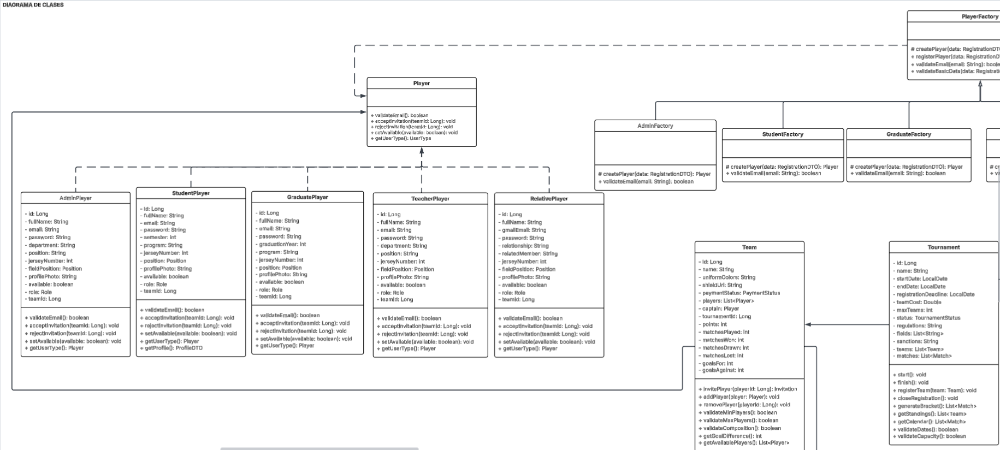
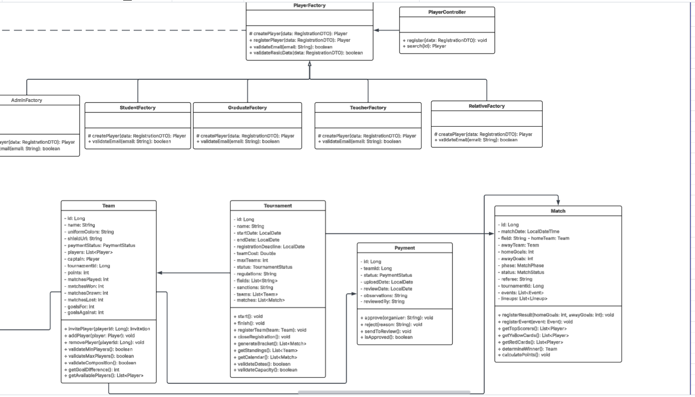

# DIAGRAMAS DE ARQUITECTURA

---

Link diagramas: https://lucid.app/lucidchart/3777f7f9-49cb-4f47-859d-86e581460502/edit?view_items=1IvEfELT4osh&page=0_0&invitationId=inv_96e5594f-9313-43cc-99e2-2ea8478b8063

## Diagrama De Clases

**Patrón utilizado: Factory Method**

- ¿Por qué lo elegimos?
El sistema tiene cinco tipos de participantes Estudiante, Graduado, Profesor, Personal Administrativo y Familiar que 
comparten atributos comunes como nombre, correo y posición de juego, pero tienen diferencias concretas en cómo se crean
y validan. El Estudiante y el Graduado se registran con correo institucional, el Familiar con Gmail, el Profesor tiene 
departamento y cargo.

- ¿Cómo ayuda a resolver el problema del sistema?
Factory Method centraliza la creación de cada tipo de Jugador en su propia fábrica. Cuando llega una solicitud de 
registro al PlayerController, este simplemente delega a la PlayerFactory correspondiente según el userType recibido, 
y esa fábrica construye el objeto correcto con sus validaciones propias.

## Diagrama De Componentes General y Especifico

**General**

**Específico**

